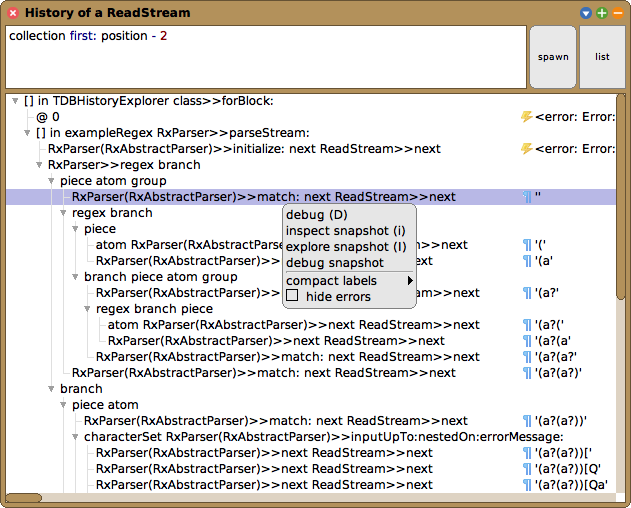

Hi, I‘m Christoph! I am a **research student in software engineering** with a strong passion for improving developer productivity. I have developed a [conversational programming agent using GPT-4](https://github.com/hpi-swa-lab/SemanticSqueak) and a [back-in-time debugger](https://github.com/hpi-swa-lab/squeak-tracedebugger) for Squeak/Smalltalk, a [VS Code extension to analyze downstream dependencies](https://github.com/LinqLover/downstream-repository-mining), and several other prototypes. As a core developer of Squeak, I [contribute](#contributions-to-squeak) to several areas such as its code browsing and debugging tools. In my spare time, I also play jazz piano, am often out in nature, and am owned by two cats.

***Contact:** [Email](mailto:christoph.thiede@outlook.de) · [LinkedIn](https://www.linkedin.com/in/christoph-thiede-20a0b8207/) · [ResearchGate](https://www.researchgate.net/profile/Christoph-Thiede) · [GitHub](https://github.com/LinqLover)*

## Experiences

- ### Student Research and Teaching Assistant

  Hasso Plattner Institute, Software Architecture Group  
  2019-08 – present
  
  As a student research assistant, I maintain and extend the [Squeak IDE](#contributions-to-squeak), support and conduct my own [research projects](https://www.hpi.uni-potsdam.de/hirschfeld/) on programming and debugging tools, and have co-authored a [textbook](#publications) on Squeak.
  
  As a teaching assistant, I supervised a team of undergraduate students in a [software engineering project](https://hpi-de.translate.goog/studium/im-studium/lehrveranstaltungen/it-systems-engineering-ba/lehrveranstaltung/sose-22-3471-softwaretechnik-i.html?_x_tr_sl=auto&_x_tr_tl=en&_x_tr_hl=de&_x_tr_pto=wapp) and guided them through agile practices and technical issues.
  
  ***Skills:** Squeak/Smalltalk · OOP · Academic Writing · Agile Methods*
  
- ### Student Software Engineering Assistant
  
  Museums of the Hasso Plattner Foundation  
  2020-08 – present
  
  At the HPF, I am responsible for maintaining and extending [Barberini Analytics](https://github.com/Museum-Barberini/Barberini-Analytics), a data mining and analytics platform that provides management and PR teams with business insights from data sources such as social media, review platforms, and the internal customer system.
  
  ***Skills:** Python · PostgreSQL · Basic Linux Administration*

## Education

- ### *M.Sc. IT-Systems Engineering*

  Hasso Plattner Institute  
  2021-04 – 2025-09 (expected)  
  Current average grade: 1.0 (very good)
  
  Highlighted courses: Programming Experience · Reverse Engineering · Advanced Programming Tools · Parallel Programming and Heterogeneous Computing · Neurodesign · Global Design Thinking Workshop
  
  Master thesis (in progress): *The Semantic Workspace: Augmenting Exploratory Programming with Integrated Generative AI Tools*
  
- ### B.Sc. IT-Systems Engineering

  Hasso Plattner Institute  
  2017-10 – 2021-03  
  Final grade: 1.5 (very good)
  
  Highlighted courses: Project Management · Programming of User Interfaces · Agile Software Development in Large Teams
  
  Bachelor thesis: *Exploring Museum-Related Social Media Posts Using Aspect-Based Sentiment Analysis*

## Featured Projects

- ### [SemanticSqueak](https://github.com/hpi-swa-lab/SemanticSqueak)

  2023-08 – present
  
   
  
  Augmenting exploratory programming by integrating conversational and autonomous agents into Squeak. Also implemented the [SemanticText](https://github.com/LinqLover/Squeak-SemanticText) framework for generative AI, semantic search, and an OpenAI API client. A scientific paper will be presented at the Onward! 2024 conference.

- ### [trace4d](https://github.com/LinqLover/trace4d)

  2023-04 – 2024-02
  
  

  Research prototype to visualize program behavior through interactive, animated 2.5D object maps using Three.js and D3.js. Presented in a scientific paper at the IVAPP 2024 conference.

- ### [TraceDebugger](https://github.com/hpi-swa-lab/squeak-tracedebugger)

  2021-10 – 2024-01
  
   
  
  TraceDebugger is a **back-in-time debugger** for Squeak that aims to improve the navigation experience and immediacy during debugging. Among other things, I proposed a **novel state-centric perspective** and presented it in our [scientific papers](#publications) at the Programming Experience 2023 workshop and the Onward! 2023 conference.

- ### [Contributions to Squeak](https://html-preview.github.io/?url=https://github.com/LinqLover/LinqLover/blob/artifacts/squeak-ct-contribs-outline-formatted.html)

  2019-05 – present
  
  
  
  [Squeak](http://squeak.org/) is an **interactive programming system** for Smalltalk that is completely implemented in itself and promotes values such as flexibility, liveness, and explorability. I am engaging in the design and implementation of several subsystems, including **tools for code browsing, debugging, and version control, the UI system, the exception handling system, and others.** Since 2021, I am also a member of the **core developers** team. Working on a system of this complexity also gives me many opportunities to learn about common trade-offs such as compatibility and modularity, quality and quantity, or products and people.

  Major accomplishments:

  - **Reworked the inspector tool family,** added watch expressions, and designed a new extension API.
  - Fixed several critical bugs in the **debugging infrastructure** and the exception handling system.
  - Supported the **Squeak 6.0 release,** in particular by authoring the [release notes](https://raw.githubusercontent.com/squeak-smalltalk/squeak-app/squeak-trunk/release-notes/6.0).

- ### [Contributions to VBRegex](https://source.squeak.org/trunk/Regex-Core-ct.78.diff)

  2020-03 – present
  
  
  
  VBRegex is a **regular expression engine** for Squeak/Smalltalk that emphasizes an explorable implementation and a clean object-oriented design. I co-maintain the project and have contributed **several bug fixes** and new features such as **named capture groups (`(?<name>)`, lookarounds (`(?<=)` etc.), match resets (`\K`), and others.** I also built a [visualization tool](https://github.com/LinqLover/Regex-Tools) to explore the matcher‘s behavior.

- ### [SimulationStudio](https://github.com/LinqLover/SimulationStudio)

  2021-05 – present
  
   
  
  SimulationStudio exploits the flexible nature of Squeak‘s call stack model and provides a **framework for fine-grained control of the execution** through code simulation. Building on this, SimulationStudio offers a **sandbox for isolated execution** and multiple tools for the **behavior-centric exploration** of classes and objects.

- ### [Downstream Repository Mining](https://github.com/LinqLover/downstream-repository-mining)

  2021-04 – 2022-04
  
  
  
  I developed a **VS Code extension in TypeScript** that **collects downstream dependency projects** for npm packages from GitHub & Co. and allows package developers to **analyze usage samples** from their IDE. I presented the tool and the underlying approach in our [scientific paper](#publications) at the ENASE/2022 conference.

- ### [Sonyx](https://hpi.de/neurodesign/projects/sonyx.html)

  2021-04 – 2022-05
  
  <!-- <video alt="Sonyx" src="https://user-images.githubusercontent.com/38782922/131224109-b474991a-5558-4a62-aff4-ed17e512e663.mp4" height="200"> -->
  
  
  Sonyx is a research prototype that attempts to **support exploratory programming tasks** through the use of **auditory displays.** Programmers can define custom **ad-hoc sonifications** of individual program elements to inspect and monitor their source code. Our user study indicated that auditory displays can make programmers more satisfied and effective.

## Publications

- Christoph Thiede. 2024. [The Semantic Workspace: Augmenting Exploratory Programming with Integrated Generative AI Tools.](https://github.com/LinqLover/semexp-thesis/releases/download/submission/semexp-thesis.pdf) Master’s Thesis. Hasso Plattner Institute, 161 pages. To be defended.
- Christoph Thiede, Marcel Taeumel, Lukas Böhme, and Robert Hirschfeld. 2024. [Talking to Objects in Natural Language: Toward Semantic Tools for Exploratory Programming.](https://www.researchgate.net/publication/383085003_Talking_to_Objects_in_Natural_Language_Toward_Semantic_Tools_for_Exploratory_Programming) In *Proceedings of the 2024 ACM SIGPLAN International Symposium on New Ideas, New Paradigms, and Reflections on Programming and Software (Onward! ’24)*, October 20–25, 2024, Pascadena, California. ACM, New York, NY, USA, 17 pages. DOI: [10.1145/3689492.3690049](https://dl.acm.org/doi/10.1145/3689492.3690049). [Slides](./slides/Onward24%20Talking%20to%20Objects.pdf)/[Poster](./posters/Onward24%20Talking%20to%20Objects.pdf)/[Transcript](./transcripts/Onward24%20Talking%20to%20Objects.md).
- Christoph Thiede, Willy Scheibel, and Jürgen Döllner. 2024. [Bringing Objects to Life: Supporting Program Comprehension through Animated 2.5D Object Maps from Program Traces.](https://doi.org/10.5220/0012393900003660) In *Proceedings of the 15th International Conference on Information Visualization Theory and Applications (IVAPP 2024)*, February 27–29, Rome, Italy. SciTePress, 9 pages. DOI: [10.5220/0012393900003660](https://doi.org/10.5220/0012393900003660). [Preprint](https://linqlover.github.io/trace4d/paper-ivapp.pdf)/[Poster](https://linqlover.github.io/trace4d/poster-ivapp.pdf)/[Slides](https://linqlover.github.io/trace4d/slides-ivapp.pdf).
- Christoph Thiede, Marcel Taeumel, and Robert Hirschfeld. 2023. [Time-Awareness in Object Exploration Tools: Toward In Situ Omniscient Debugging.](https://dl.acm.org/doi/10.1145/3622758.3622892) In *Proceedings of the 2023 ACM SIGPLAN International Symposium on New Ideas, New Paradigms, and Reflections on Programming and Software (Onward! ’23)*, October 25–27, 2023, Cascais, Portugal. ACM, New York, NY, USA, 14 pages. DOI: [10.1145/3622758.3622892](https://doi.org/10.1145/3622758.3622892). [Slides](https://linqlover.github.io/LinqLover/slides/Onward23%20Time%20Awareness.pdf).
- Christoph Thiede and Patrick Rein. 2023. *[Squeak by Example.](https://wiki.squeak.org/squeak/6546)* 6.0 Edition. ISBN: 978-1-4476-2948-1. [Paperback](https://www.lulu.com/shop/patrick-rein-and-christoph-thiede/squeak-by-example-60/paperback/product-8vr2j2.html)/[PDF](https://github.com/hpi-swa-lab/SqueakByExample-english/releases/tag/6.0).
- Christoph Thiede, Marcel Taeumel, and Robert Hirschfeld. 2023. [Object-Centric Time-Travel Debugging: Exploring Traces of Objects.](https://doi.org/10.1145/3594671.3594678) In *Companion Proceedings of the 7th International Conference on the Art, Science, and Engineering of Programming (\<Programming\>’23 Companion)*, March 13–17, 2023, Tokyo, Japan. ACM, New York, NY, USA, 7 pages. DOI: [10.1145/3594671.3594678](https://doi.org/10.1145/3594671.3594678). [Slides](https://linqlover.github.io/LinqLover/slides/PX23%20Object%20Traces.pdf).
- Christoph Thiede, Willy Scheibel, Daniel Limberger, and Jürgen Döllner. 2022. [Augmenting Library Development by Mining Usage Data from Downstream Dependencies.](https://www.researchgate.net/publication/360231022_Augmenting_Library_Development_by_Mining_Usage_Data_from_Downstream_Dependencies) In *Proceedings of 17th International Conference on Evaluation of Novel Approaches to Software Engineering (ENASE 2022)*. 221–232. DOI: [10.5220/0011093700003176](https://doi.org/10.5220/0011093700003176). [Slides](https://linqlover.github.io/LinqLover/slides/ENASE22%20Downstream%20Dependencies.pdf).
- Christoph Thiede and Patrick Rein. 2021. *[Squeak by Example.](https://wiki.squeak.org/squeak/6546)* Vol. 5.3.1.

## Talks

- Wie kann dir eine KI beim Explorieren der Objekte zur Seite stehen? (How Can AI Support You While Exploring Objects?) On [*Squeak Meeting 2024*](https://squeak.de/news/2024/09/30/squeak_treffen/), November 2, 2024. Squeak e.V., Potsdam, Germany.
- Wie kann eine KI die Squeak-Mailingliste zusammenfassen? (How Can AI Summarize the Squeak Mailing List?) On [*Squeak Meeting 2023*](https://squeak.de/news/2023/10/02/squeak_treffen/), November 4, 2023. Squeak e.V., Potsdam, Germany.
- [Zurück in die Zukunft: Back-in-time-Debugging in Squeak](https://linqlover.github.io/LinqLover/slides/SqueakEv22%20TraceDebugger-de.pdf) (Back to the Future: Back-in-Time Debugging in Squeak). On [*Squeak Meeting 2022*](https://squeak.de/news/2022/10/21/squeak_treffen/), November 19, 2022. Squeak e.V., Potsdam, Germany.
- [Finden statt Suchen: Der Method-Finder wird abgesichert](https://linqlover.github.io/LinqLover/slides/SqueakEv22%20MethodFinder2-de.pdf) (Don't Search, Find: Securing the MethodFinder). On [*Squeak Meeting 2022*](https://squeak.de/news/2022/10/21/squeak_treffen/), November 19, 2022. Squeak e.V., Potsdam, Germany.
- [Auditory Displays in Programming.](https://linqlover.github.io/LinqLover/slides/ACUD%20Sonyx.pdf) On [*Making Things Audible*](https://acudmachtneu.de/events/1827/making-things-audible/), March 5–6, 2022. ACUD MACHT NEU, Berlin, Germany.
- [Squeak Inbox Talk: Social Coding Made Easy.](https://linqlover.github.io/LinqLover/slides/SqueakEv21%20Squeak%20Inbox%20Talk.pdf) On [*Squeak Meeting 2021*](https://squeak.de/news/2021/10/19/squeak_treffen/), December 4, 2021. Squeak e.V., Potsdam, Germany.
- [It’s Broken! How To Debug the Debugger.](https://linqlover.github.io/LinqLover/slides/SqueakEv21W%20Debugging%20the%20Debugger.pdf) On [*Squeak Winter Demos*](https://squeak.de/news/2021/02/09/squeak_treffen_demo/), March 6, 2021. Squeak e.V., Virtual.
- [Social Media? A Telegram Bot for Squeak.](https://linqlover.github.io/LinqLover/slides/SqueakEv21W%20TelegramBot.pdf) On [*Squeak Winter Demos*](https://squeak.de/news/2021/02/09/squeak_treffen_demo/), March 6, 2021. Squeak e.V., Virtual.

## Philosophy

I am striving to base my work on the following values:

- [**Agile:**](https://agilemanifesto.org/) Engineering should be fun, but rigid processes aren‘t! Just as slow feedback loops in your IDE can get you tired and risk-averse, delayed human feedback can also be deadly for any project. In my projects, I always seek to stay flexible and give and receive feedback as early as possible by developing incremental prototypes.
- **Eat your own dogfood:** The best way to develop a product is to learn from your own experiences with it and make it better. For example, I have used the [TraceDebugger](#tracedebugger) to fix some bugs inside its own program tracer, which also led me realize the need for a new query mechanism in the debugger that I later implemented.
- **Openness by default:** Black boxes are mean, whether on an implementational or organizational level. Transparent artifacts teach us, inspire us, and they can avoid annoying communication overhead. Whenever possible, I document and publish each of my projects.
- **Talk to people, not to machines:** Code should always tell us a story and not be obfuscated by premature optimizations. In 90% of all cases, readability matters more than performance. In the remaining 10%, I make sure to document my intentions.
- **[Kaizen](https://en.wikipedia.org/wiki/Kaizen) (改善, change for the better):** There is no perfect process, so reflection and improvement should be part of every process. In particular, I also apply kaizen to my own philosophy. :-)
