Not up to date. [Return to the home page?](./index.md)

## Experiences

- ### Student Research and Teaching Assistant

  Hasso Plattner Institute, Software Architecture Group  
  2019-08 – present
  
  As a student research assistant, I maintain and extend the [Squeak IDE](#contributions-to-squeak), support and conduct my own [research projects](https://www.hpi.uni-potsdam.de/hirschfeld/) on programming and debugging tools, and have co-authored a [textbook](#publications) on Squeak.
  
  As a teaching assistant, I supervised teams of undergraduate students in their [software architecture](https://hpi.de/kurs/softwarearchitektur-129/) and [software engineering projects](https://hpi.de/studium/im-studium/lehrveranstaltungen/it-systems-engineering-ba/lehrveranstaltung/sose-22-3471-softwaretechnik-i.html) and guided them through agile practices and technical issues.
  
  ***Skills:** Squeak/Smalltalk · OOP · Academic Writing · Agile Methods*

- ### Software Engineering Intern
  
  JetBrains  
  2025-01 – 2025-05
  
  At JetBrains, I researched and prototyped approaches for implementing reliable, reusable test runners across multiple programming languages and frameworks (Python, Gradle, Node.js), and integrated the selected solution into the Fleet platform.
  
  ***Skills:** Java/Kotlin · Python · TypeScript · Gradle*

- ### Student Software Engineering Assistant
  
  Museums of the Hasso Plattner Foundation  
  2020-08 – 2024-07
  
  At the HPF, I am responsible for maintaining and extending [Barberini Analytics](https://github.com/Museum-Barberini/Barberini-Analytics), a data mining and analytics platform that provides management and PR teams with business insights from data sources such as social media, review platforms, and the internal customer system.
  
  ***Skills:** Python · PostgreSQL · Basic Linux Administration*

## Education

- ### *M.Sc. IT-Systems Engineering*

  Hasso Plattner Institute  
  2021-04 – 2025-10
  Final grade: 1.0 (very good)
  
  Highlighted courses: Programming Experience · Reverse Engineering · Advanced Programming Tools · Parallel Programming and Heterogeneous Computing · Neurodesign · Global Design Thinking Workshop
  
  Master thesis: *The Semantic Workspace: Augmenting Exploratory Programming with Integrated Generative AI Tools*
  
- ### B.Sc. IT-Systems Engineering

  Hasso Plattner Institute  
  2017-10 – 2021-03  
  Final grade: 1.5 (very good)
  
  Highlighted courses: Project Management · Programming of User Interfaces · Agile Software Development in Large Teams
  
  Bachelor thesis: *Exploring Museum-Related Social Media Posts Using Aspect-Based Sentiment Analysis*

## Featured Projects

- ### [SemanticSqueak](https://github.com/hpi-swa-lab/SemanticSqueak)

  2023-08 – 2024-11
  
  <a href="./assets/SemanticSqueak-agent.png">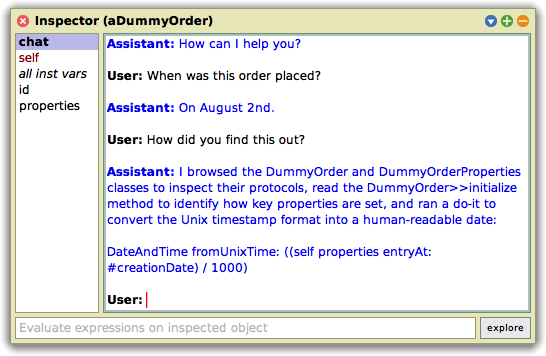</a> <a href="./assets/exploratory-programming-agent-agent.png">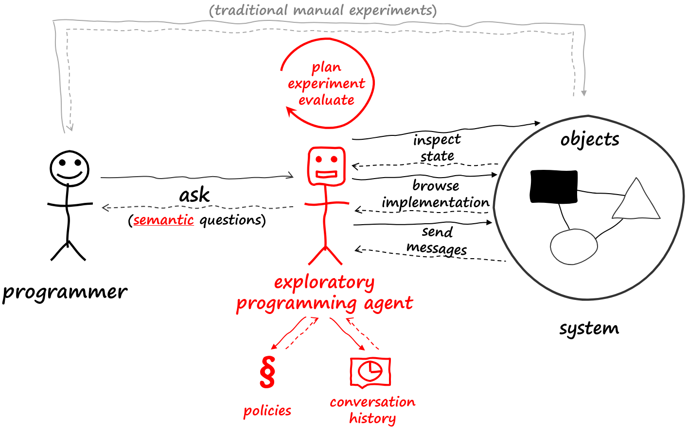</a>
  
  Augmenting exploratory programming by integrating conversational and autonomous agents into Squeak. Also implemented the [SemanticText](https://github.com/LinqLover/Squeak-SemanticText) framework for generative AI, semantic search, and an OpenAI API client. A scientific paper was presented at the Onward! 2024 conference.

- ### [trace4d](https://github.com/LinqLover/trace4d)

  2023-04 – 2024-02
  
  <a href="./assets/trace4d.png">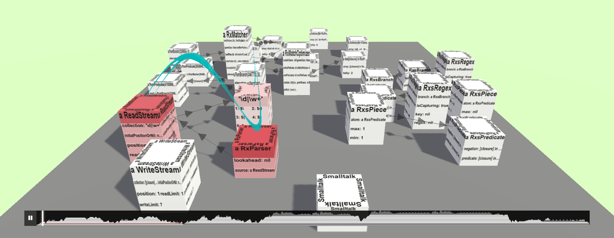</a>

  Research prototype to visualize program behavior through interactive, animated 2.5D object maps using Three.js and D3.js. Presented in a scientific paper at the IVAPP 2024 conference.

- ### [TraceDebugger](https://github.com/hpi-swa-lab/squeak-tracedebugger)

  2021-10 – 2024-01
  
  <a href="./assets/TraceDebugger.png">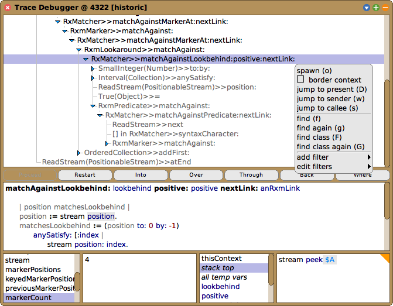</a> <a href="./assets/HistoryExplorer.png">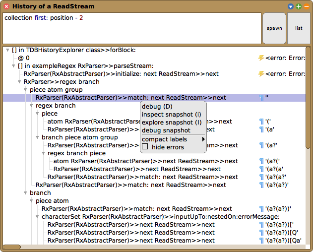</a>
  
  TraceDebugger is a **back-in-time debugger** for Squeak that aims to improve the navigation experience and immediacy during debugging. Among other things, I proposed a **novel state-centric perspective** and presented it in our [scientific papers](#publications) at the Programming Experience 2023 workshop and the Onward! 2023 conference.

- ### [Contributions to Squeak](https://html-preview.github.io/?url=https://github.com/LinqLover/LinqLover/blob/artifacts/squeak-ct-contribs-outline-formatted.html)

  2019-05 – present
  
  <a href="./assets/Squeak-inspectors.png">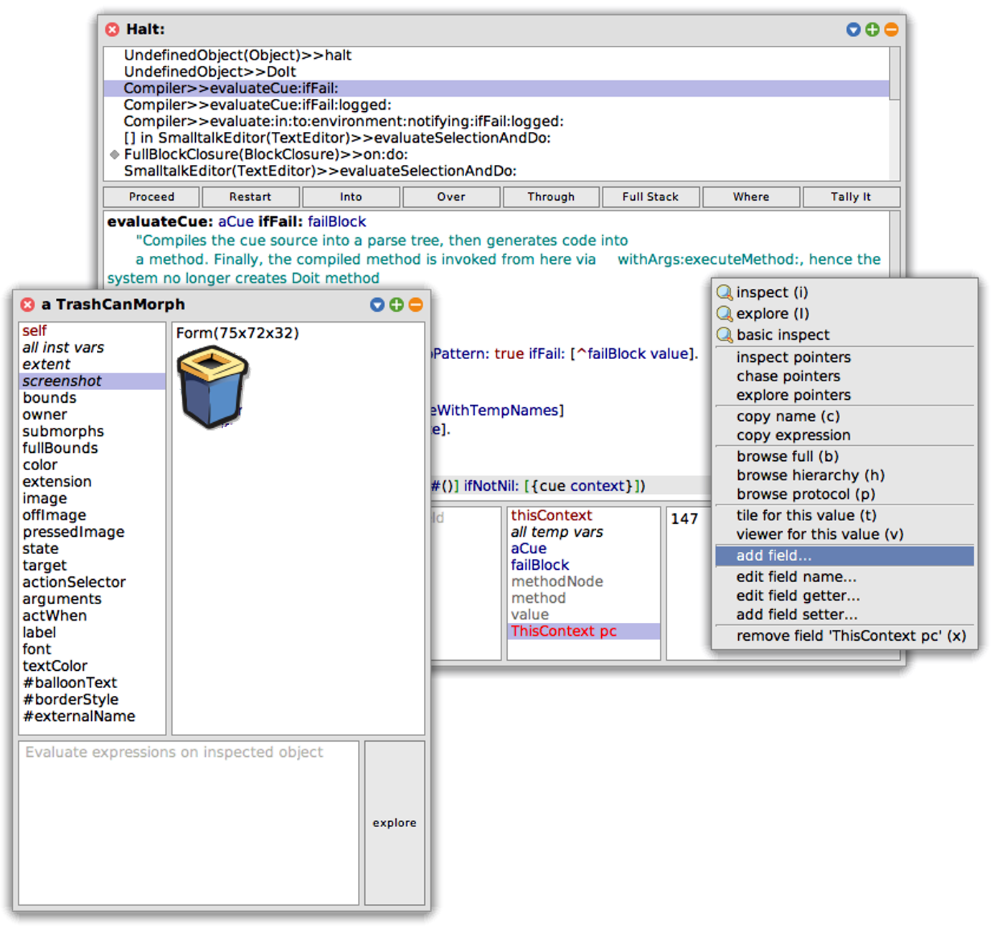</a>
  
  [Squeak](http://squeak.org/) is an **interactive programming system** for Smalltalk that is completely implemented in itself and promotes values such as flexibility, liveness, and explorability. I am engaging in the design and implementation of several subsystems, including **tools for code browsing, debugging, and version control, the UI system, the exception handling system, and others.** Since 2021, I am also a member of the **core developers** team. Working on a system of this complexity also gives me many opportunities to learn about common trade-offs such as compatibility and modularity, quality and quantity, or products and people.

  Major accomplishments:

  - **Reworked the inspector tool family,** added watch expressions, and designed a new extension API.
  - Fixed several critical bugs in the **debugging infrastructure** and the exception handling system.
  - Supported the **Squeak 6.0 release,** in particular by authoring the [release notes](https://raw.githubusercontent.com/squeak-smalltalk/squeak-app/squeak-trunk/release-notes/6.0).

- ### [Contributions to VBRegex](https://source.squeak.org/trunk/Regex-Core-ct.78.diff)

  2020-03 – present
  
  <a href="./assets/Regex-Tools-backreference.png">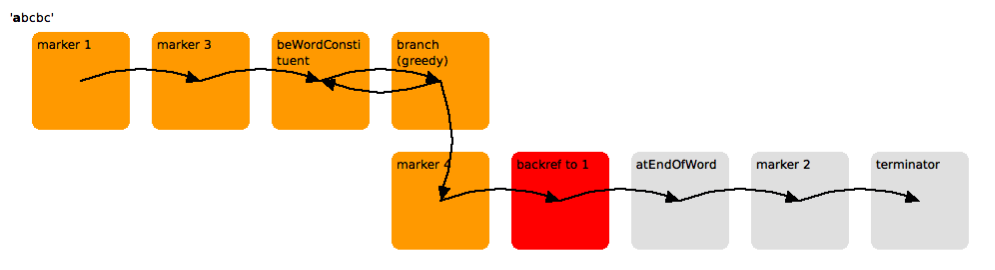</a>
  
  VBRegex is a **regular expression engine** for Squeak/Smalltalk that emphasizes an explorable implementation and a clean object-oriented design. I co-maintain the project and have contributed **several bug fixes** and new features such as **named capture groups (`(?<name>)`, lookarounds (`(?<=)` etc.), match resets (`\K`), and others.** I also built a [visualization tool](https://github.com/LinqLover/Regex-Tools) to explore the matcher‘s behavior.

- ### [SimulationStudio](https://github.com/LinqLover/SimulationStudio)

  2021-05 – present
  
  <a href="./assets/SimulationMethodFinder.png">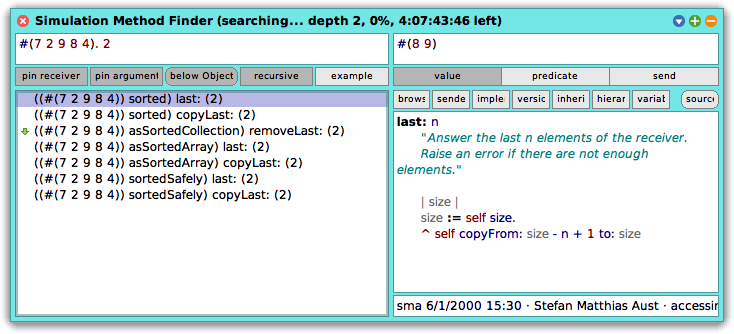</a> <a href="./assets/SimulationProtocolExplorer.png">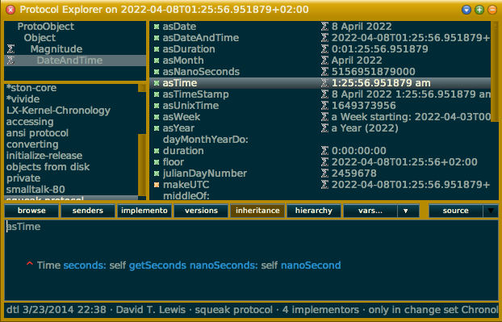</a>
  
  SimulationStudio exploits the flexible nature of Squeak‘s call stack model and provides a **framework for fine-grained control of the execution** through code simulation. Building on this, SimulationStudio offers a **sandbox for isolated execution** and multiple tools for the **behavior-centric exploration** of classes and objects.

- ### [Downstream Repository Mining](https://github.com/LinqLover/downstream-repository-mining)

  2021-04 – 2022-04
  
  <a href="./assets/dowdep-dependencies.png">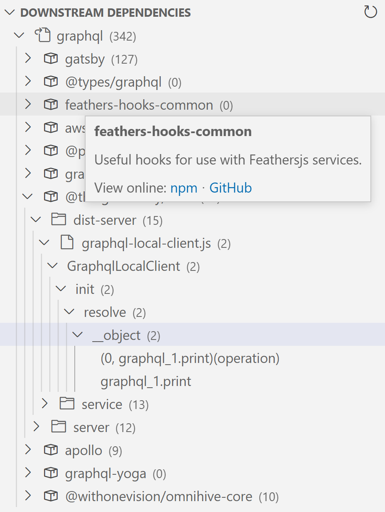</a>
  
  I developed a **VS Code extension in TypeScript** that **collects downstream dependency projects** for npm packages from GitHub & Co. and allows package developers to **analyze usage samples** from their IDE. I presented the tool and the underlying approach in our [scientific paper](#publications) at the ENASE/2022 conference.

- ### [Sonyx](https://hpi.de/neurodesign/projects/sonyx.html)

  2021-04 – 2022-05
  
  <!-- <video alt="Sonyx" src="https://user-images.githubusercontent.com/38782922/131224109-b474991a-5558-4a62-aff4-ed17e512e663.mp4" height="200"> -->
  <a href="https://youtu.be/t6or4fR2c-k" target="_blank">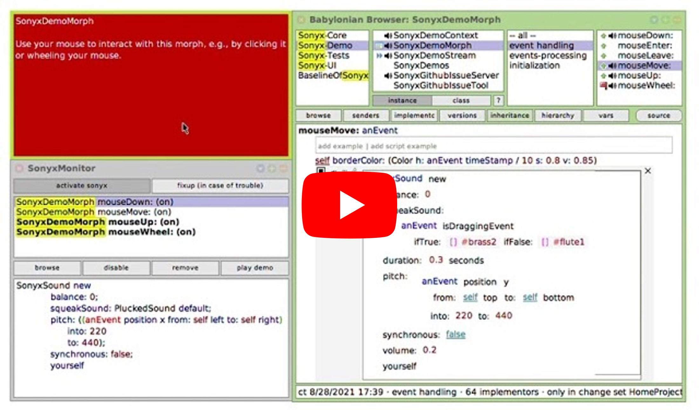</a>
  
  Sonyx is a research prototype that attempts to **support exploratory programming tasks** through the use of **auditory displays.** Programmers can define custom **ad-hoc sonifications** of individual program elements to inspect and monitor their source code. Our user study indicated that auditory displays can make programmers more satisfied and effective.
