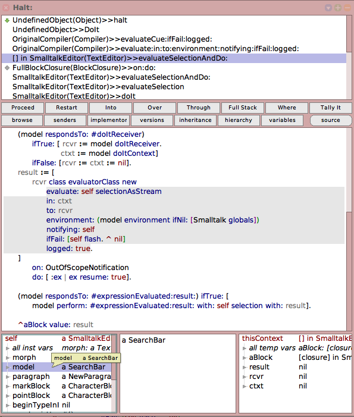
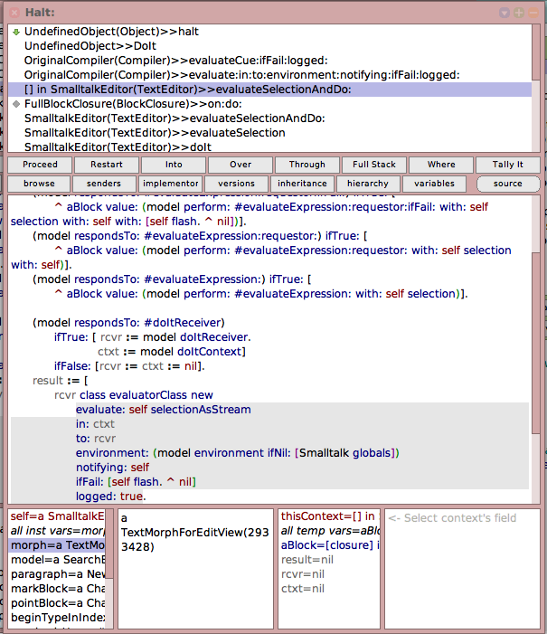

## Motivation

Inspectors and explorers have different strengths and weaknesses:

- **Inspectors:**
  - Offer more features: changing variables, drag’n’drop, truncation of long lists, most seamless stepping and error handling, introspection (copy expression/debug getter/…)
  - Currently widest support for different domains: collections, block closures, compiled methods, morphs, …
  - Can be customized by both users (custom fields) and domain developers (object-specific fields and menus)
- **Explorers:**
  - Provide an immediate overview of all values in an object ➡️ faster navigation, serendipitous discoveries
  - Support hierarchical navigation through nested objects

**How can we combine the best of both tools?**

## Approach

Use the more profound technical foundation of the inspector and extend it with an explorer-like, hierarchical UI.

## Case Study 1: Hierarchical Inspectors

- The tree contains the fields of the inspector:
  - The first field (`self`) becomes the root of the tree.
  - All other fields become the children of the root node.
  - Every tree node displays the name and the current value of the field.
  - All fields (but the first one) contain nested children from an inspector on their value.
- The tree is expanded to the width of the inspector, the value pane moves below the tree in place of the expression pane. The expression pane is removed.
- Value pane and menus operate on the inspector that belongs to the selected field *(not yet implemented)*.

**Challenges encountered:**

- Evaluating all inspector fields eagerly during stepping causes serious performance issues in some problems (e.g., `World inspect` because of the screenshot field).
  - ➡️ Premature solution: Time-out label computation of any field after 1 ms; for timed-out nodes, continue label computation in a background process and update the node when done.
    - Deferred label updates lead to flickering in the UI; process browser may be flooded with many ephemeral processes (UX limitation of the process browser).
    - Background path is reached rarely, maybe discard it.
- Some field names are very long and shift values too much to the right.
  - ➡️ Truncate labels *(not yet implemented)*.

**Discussion:**

- Only one pane for both value display and do-its left. No longer possible to read the full contents of a field without deleting/cutting the previous do-it. Muscle memory hurt because `Cmd + i -> move cursor to the right -> type` no longer works.
  - People might relearn. Debugger also offers no dedicated evaluation pane.

**Upstream issues observed:**

- Bug: Typing do-its into the value pane with a form breaks the text editor *(add fallback font?)*.
- Bug/inconvenience: `PluggableTreeMorph` loses color of node label while selecting a node (`PluggableListMorph` does not).
- Performance: Updating children and labels of single nodes is not efficient(ly possible?). Worlds with many hierarchical inspectors and stepping in debuggers with hierarchical inspectors (see below) feel (?) slightly slower.
- Bug/inconvenience: Stepping in debuggers `changed: #objectChanged` turns the reported node green *(temporarily disabled for the spike)*.

## Case Study 2: Hierarchical Inspectors in Debugger

- The receiver inspector and context variables inspector at the bottom of full debuggers are replaced by hierarchical inspectors.
- The value pane of the context variables inspectors is removed and the remaning panes are arranged equally to ensure minimum readability of tree nodes.

**Challenges encountered:**

- Many tree items are still too long for being readable in the trees.
  - ➡️ Minor layout optimization: Allow `PluggableTreeMorph>>SimpleHierarchicalListMorph>>#autoExpandSelector:` to discriminate by item to save 12 px before the root item.
  - ➡️ Display full node label in tooltip.
  - ❌ Still, not enough space.
- Long field names shift values much too much to the right.
  - ➡️ Limit first column width to 50 % of the tree.
- Cannot view the full contents of a context variable any longer.
  - ➡️ Idea 1 *(not yet implemented)*: Reuse central value pane for variables from both inspectors.
    - Possible disadvantages: It might become less clear to which inspector the displayed contents belong. Could automatically remove selection in the second-to-last used inspector, but this might be counterintuitive.
  - ➡️ Idea 2 *(not yet implemented)*: Stack two value panes on top of each other.
    - Even less vertical space within each value pane.

**Other design considered *(not yet tried out):***

- Merge both roots (`self` and `thisContext`) into a single hierarchical inspector (similar to mainstream debuggers with nested scopes):
  - More horizontal space for node labels and the value pane, but overseeing both instance and context variables at the same time would require frequent scrolling.

## Case Study 3: Traditional Inspectors in Debugger, Augmented with Values

- Remain with the traditional inspectors layout in the debugger.
- Augment inspector fields with their values.

**Discussion:**

- More familiar, more space left for parallel inspection of receiver and context variables.
- Potential faster overview/serendipitous discoveries but no hierarchical navigation.
- Augmented values only really helpful for fields with short variable names.
- More chaotic UI
  - ➡️ Display values in secondary style (greyed out/smaller)? Not yet supported in `LazyListMorph`s.

## Conclusion and Future Work

- Hierarchical inspectors as a standalone tool look promising. Will do further testing and try to adapt my own muscle memory.
- Adding more information into the debugger is hard because of space constraints.
  - A more fundamental issue is the rigid arrangement of the debugger, which does not follow the small windows pattern seen in other tools.
  - Maybe we could come up with alternative, more flexible and more Smalltalk-ish debugger layouts in the future. Protruding tool windows that are detached from the main debugger window but stick to its borders (cf. Vivide)? One-click layout presets for showing/compacting single panes (cf. Pharo debugger)? What else?